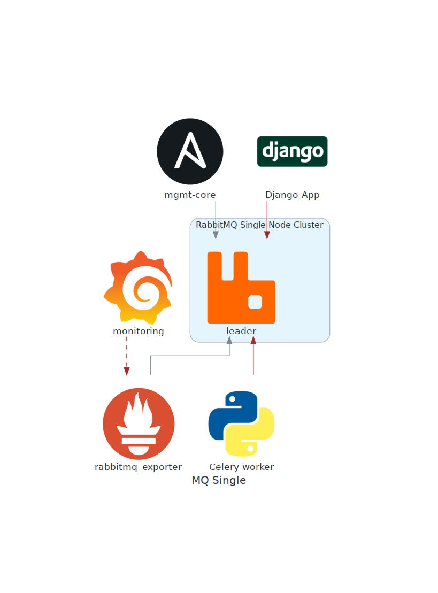
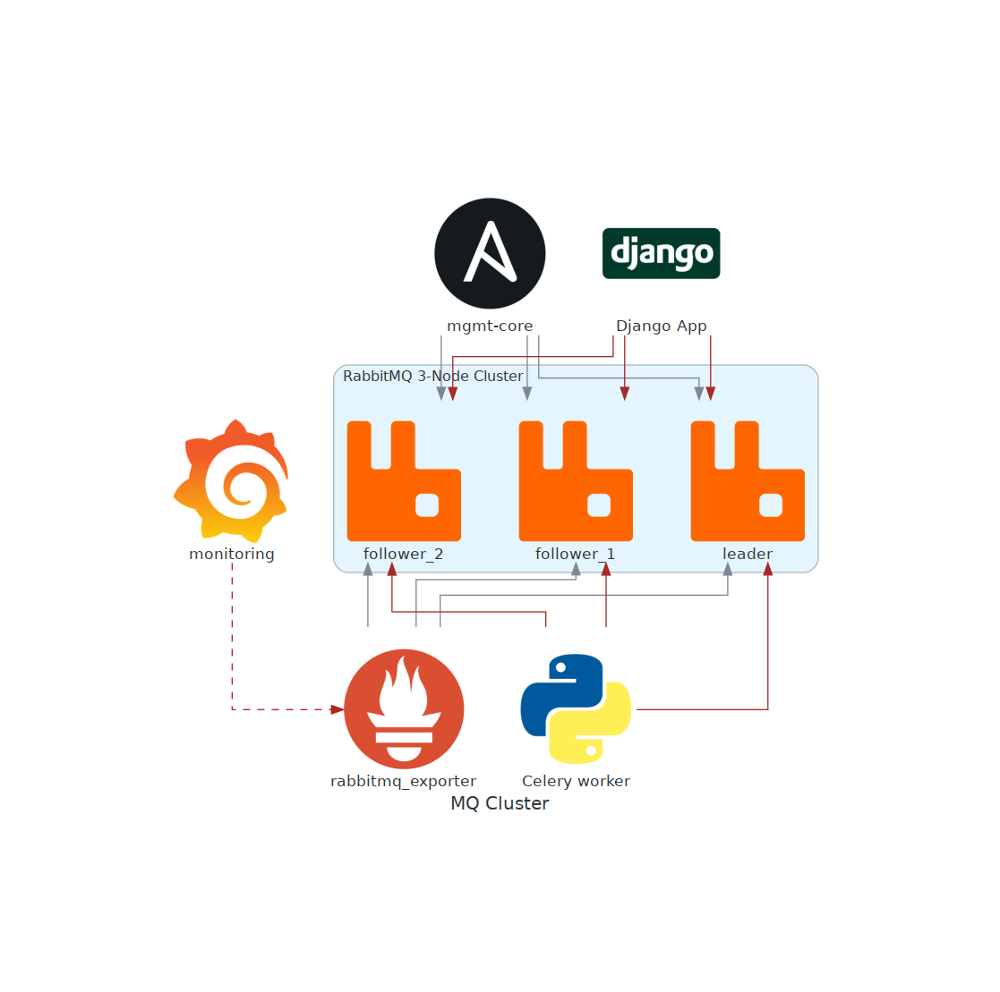

# Table of Content

<!-- MarkdownTOC -->

- Ansible Role: RabbitMQ Cluster
- Requirements
- Must-have Role Variables
- Optional Role Variables and Defaults
- Example
- License
- Author Information
  <!-- /MarkdownTOC -->

## Ansible Role: RabbitMQ Cluster

An Ansible Role, that installs a RabbitMQ multi-node cluster.

This project is inspired by `alexey-medvedchikov/ansible-rabbitmq`.

Major changes and differences:

- TLS/SSL
- high availability queues
- Simple template and config
- More comments and more readable code

## Requirements

None, but note that `hostname -f` should work on every node, and this is especially worth paying some attention if you work with AWS EC2 instances, since in aws the host name is like `ip-xxx-xxx-xxx-xxx.eu-central-1.compute.internal`.

## Must-have Role Variables

Must have variables are listed below:

    rabbitmq_cluster_master: hostname

This parameter is used to determine which node is the master, because some tasks should only be run on master or slave, like slave joins into a cluster.

This role uses ansible fqdn equals `rabbitmq_cluster_master` or not to determine if it's master or slave.

## Schemes

### Single Node cluster look a like

### 3-Node cluster look a like

## Optional Role Variables and Defaults

All the other variables are optional and listed below along with default values (see `defaults/main.yml`):

    update_hosts: false

Whether you need to update hosts file or not, default false. This is useful when you are using AWS EC2 instance, whose default hostname is too long and doesn't have a meaning, like "ip-10-101-50-12.eu-central-1.compute.internal", but you want to use something shorter and meaningful as hostname. In this case you need to set this variable to true in order to update the hosts file, and you need to define a variable named "rabbitmq_hosts", with the following format:

    rabbitmq_hosts: |
      node-1-ip node-1-FQDN
      node-2-ip node-2-FQDN

example:

    rabbitmq_hosts: |
      10.0.0.10 eu-central-1-mq-master   (whatever the command `hostname -f` outputs on this host)
      10.0.0.11 eu-central-1-mq-slave-01 (whatever the command `hostname -f` outputs on this host)

    rabbitmq_cluster: yes

To use cluster or not. Default yes, which means slave will join the master as a cluster.

    rabbitmq_erlang_cookie: WKRBTTEQRYPTQOPUKSVF

RabbitMQ nodes and CLI tools (e.g. rabbitmqctl) use a cookie to determine whether they are allowed to communicate with each other. For two nodes to be able to communicate they must have the same shared secret called the Erlang cookie.

For more info see: [Clustering](https://www.rabbitmq.com/clustering.html)

    rabbitmq_use_longname: 'false'

When set to true this will cause RabbitMQ to use fully qualified names to identify nodes. This may prove useful on EC2. Note that it is not possible to switch between using short and long names without resetting the node.

For more info see: [define-environment-variables](https://www.rabbitmq.com/configure.html#define-environment-variables)

    rabbitmq_logrotate_period: weekly
    rabbitmq_logrotate_amount: 8

Log rotation settings.

    rabbitmq_limit_files: 4096
    rabbitmq_limit_sockets: 4096
    rabbitmq_memlock_enabled: no

The main setting that needs adjustment is the max number of open files, also known as ulimit -n. The default value on many operating systems is too low for a messaging broker (eg. 1024 on several Linux distributions). RabbitMQ recommends allowing for at least 65536 file descriptors for user rabbitmq in production environments. 4096 should be sufficient for most development workloads.

More info at: [Install Debian](https://www.rabbitmq.com/install-debian.html)

    rabbitmq_tls_port: 5671
    rabbitmq_epmd_port: 4369
    rabbitmq_node_port: 5672

RabbitMQ default ports.

    rabbitmq_plugins:
      - rabbitmq_management
      - rabbitmq_management_agent
      - rabbitmq_shovel
      - rabbitmq_shovel_management

Plugins installed by default, mainly for HTTP API monitor.

    rabbitmq_enable_tls: false

Enable TLS/SSL or not.

    rabbitmq_tls_only: false

If true, only TLS port is open; default amqp port 5672 will be disabled.

    rabbitmq_tls_verify: "verify_none"
    rabbitmq_tls_fail_if_no_peer_cert: false

Settings for TLS. More info at: [SSL](https://www.rabbitmq.com/ssl.html)

    rabbitmq_cacertfile: ""
    rabbitmq_cacertfile_dest: "/etc/rabbitmq/cacert.pem"

    rabbitmq_certfile: ""
    rabbitmq_certfile_dest: "/etc/rabbitmq/cert.pem"

    rabbitmq_keyfile: ""
    rabbitmq_keyfile_dest: "/etc/rabbitmq/key.pem"

If TLS is enabled, you need to specify cacert/certfile/keyfile location, and where to put them on the server.

    rabbitmq_backup_queues_in_two_nodes: false

By default, queues within a RabbitMQ cluster are located on a single node (the node on which they were first declared). Queues can optionally be made mirrored across all nodes, or exactly N number of nodes. By enabling this variable to true, there will be 1 queue leader and 1 queue mirror. If the node running the queue leader becomes unavailable, the queue mirror will be automatically promoted to leader.

More info see: [HA](https://www.rabbitmq.com/ha.html)

## Example

Playbook:

    ---
    - hosts: mq-cluster
      become: yes
      become_user: root
      roles:
        - rabbitmq

Group vars file 'mq-cluster':

    rabbitmq_cluster_leader: mq-cluster-leader
    update_hosts: true
    rabbitmq_hosts: |
      10.0.0.10 mq-cluster-master
      10.0.0.11 mq-cluster-slave-01
    rabbitmq_enable_tls: true
    rabbitmq_cert_dir: "{{ playbook_dir }}/../common_files/ssl"
    rabbitmq_cacertfile: "{{ cert_dir }}/cacert.pem"
    rabbitmq_certfile: "{{ cert_dir }}/cert.pem"
    rabbitmq_keyfile: "{{ cert_dir }}/key.pem"
    rabbitmq_backup_queues_in_two_nodes: true

Inventory file:

    [mq-cluster]
    10.0.0.10
    10.0.0.11

## License

MIT / BSD

## Author Information

This role was created between late 2017 and early 2018 by [Tiexin Guo].
